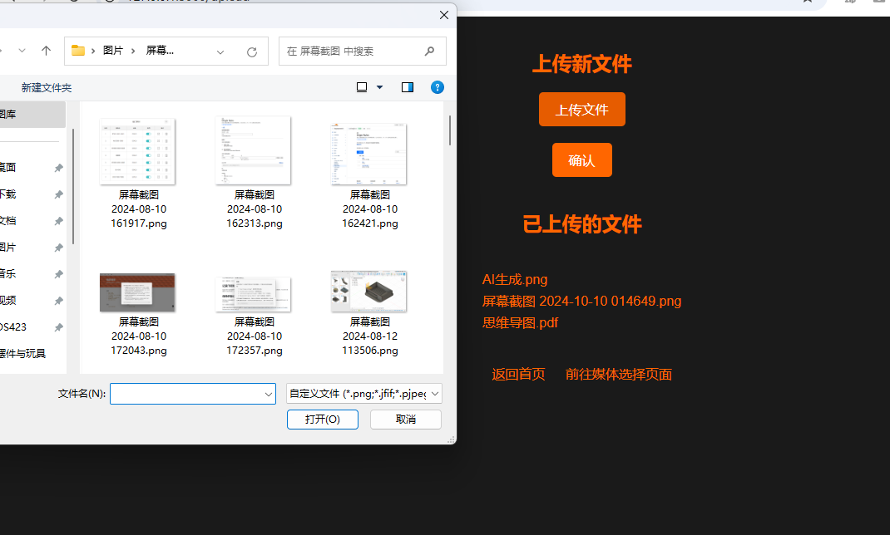
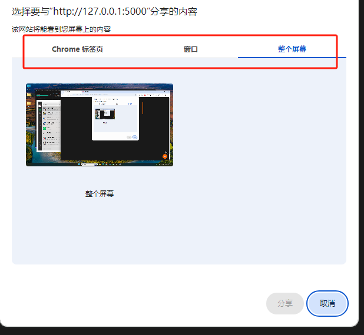

# Screen Sharing and File Transfer Tool

[English](README.md) | [中文](README_CN.md)

1. When your computer cannot be connected to the TV via a video cable, it may be due to insufficient cable length or incompatible interfaces, but your TV happens to support browser functionality.

2. When you are attending training or communication events outside, and only one WiFi network is provided on site. Everyone has just become familiar with it, and it's about to start screen sharing. You need a quick way for everyone to see your screen.

At this time, you need a tool to capture and share your screen and audio (including device audio and microphone input) and share it with others via the web page. In this way, the audience does not need to download any meeting software and can watch it by simply opening the browser.

Of course, sometimes you need to provide necessary files, such as code and documents. So this program also allows you to upload and download files. Uploaded files will be saved in the `upload` folder in the current directory, and you can also download files from the `upload` folder.

For example, a partner uploads the `test.txt` file, and another partner can download the file.

## Install Dependencies

`pip install Flask`


## Project Directory Structure

There are two folders in the project: `templates` and `uploads`.

- The `templates` folder is used for page display.
- The `uploads` folder is used to save uploaded files.
```bash showLineNumbers
your_project/
├── templates/
├── uploads/
└── app.py
``` 
## Usage

```bash
# 模块安装
pip install flask 

# 运行
python app.py
```

## show in use





