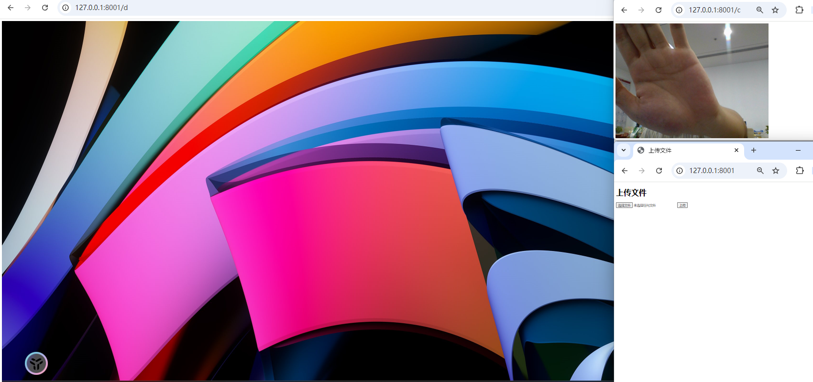

# Screen Sharing and File Transfer Tool

[English](README.md) | [中文](README_CN.md)

This tool allows you to capture and share your screen and audio (including device audio and microphone input) through a web interface. It's particularly useful in situations where:

1. Your computer can't connect to a TV via video cable due to length or compatibility issues, but the TV has a browser function.

2. You're at a training or networking event with only a WiFi network available, and you need to quickly share your screen with others.

Viewers can watch your screen without downloading any meeting software, just by opening a browser.

The program also allows you to upload and download files. Uploaded files are saved in the `upload` folder in the current directory, and can be downloaded from there.

For example, if a colleague uploads a `test.txt` file, another can download it from `http://127.0.0.1:8001/download/test.txt`.

## Installation

```bash
pip install flask opencv-python Pillow greenlet pyaudio Flask
```

## Project Structure

The project has two folders: templates and uploads.

The templates folder contains an upload.html file for page display.

The uploads folder is used to store uploaded files.

```bash showLineNumbers
your_project/
├── templates/
│   └── upload.html
│   └── stream.html
├── uploads/
└── app.py
```

## Routes

`/` route: Handles file upload functionality.

`/d` route: Provides desktop video stream + audio stream.

`/c` route: Provides camera video stream + audio stream.

`/download/<filename>` route: Provides file download functionality.

## Usage

```bash
# Install modules
pip install flask opencv-python Pillow greenlet pyaudio Flask

# Run
python app.py
```


