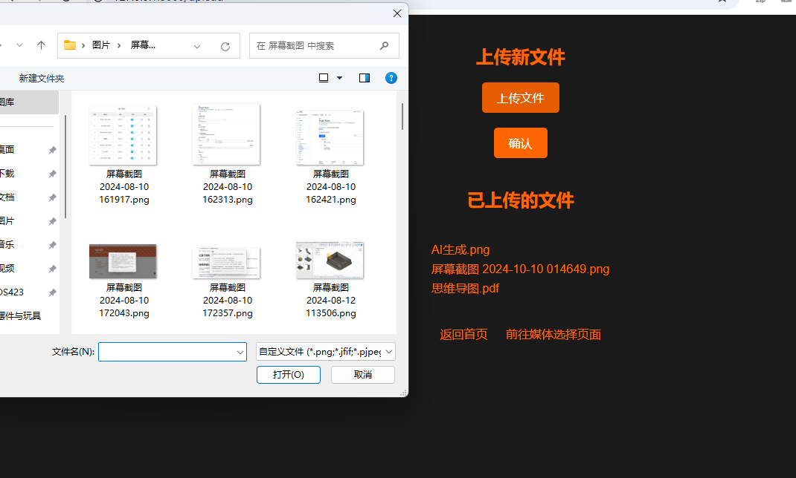
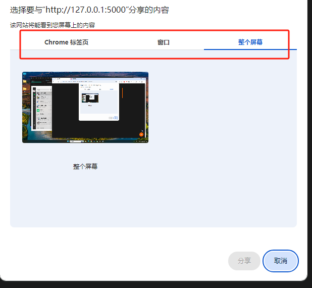

# 屏幕共享和文件传输工具

[English](README.md) | [中文](README_CN.md)

1. 当你的电脑无法通过视频线连接到电视机，可能是由于线缆长度不足或者接口不兼容，而你的电视机恰好支持浏览器功能。

2. 当你在外面参加培训或交流活动，现场只提供了一个WiFi网络。大家刚刚熟悉，马上就要开始屏幕分享，你需要一个快速的方式让大家都能看到你的屏幕。

这个时候，你就需要一个工具来捕获和分享你的屏幕和音频（包括设备音频和麦克风输入），并通过网页形式与他人共享。这样，观众无需下载任何会议软件，仅需打开浏览器即可观看。

当然有时候你需要提供必要的文件，比如代码，文档等。所以这个程序还允许你上传与下载文件。上传的文件会保存在当前目录下的`upload`文件夹中，你也可以从`upload`文件夹中下载文件。

例如一个伙伴上传了`test.txt`文件，另一个伙伴可以下载文件。

## 安装依赖

```bash
pip install Flask
```

## 项目目录结构

项目下有两个文件夹： templates 和 uploads。

templates 文件夹用于页面展示。

uploads 文件夹用于保存上传的文件。

```bash showLineNumbers
your_project/
├── templates/
├── uploads/
└── app.py
``` 

## 使用

```bash
# 模块安装
pip install flask 

# 运行
python app.py
```

## 使用截图





